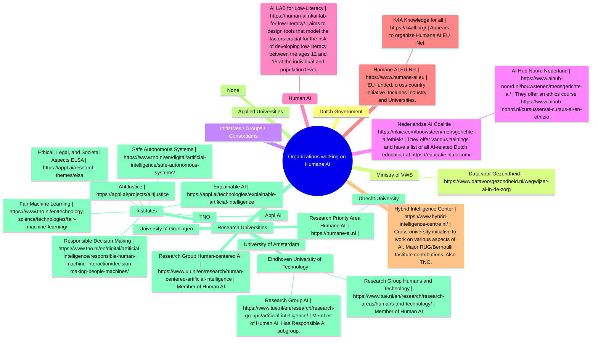

```mermaid
mindmap
	root((Organizations working on Humane AI))
  		Dutch Government
				Ministry of VWS
						Data voor Gezondheid | https://www.datavoorgezondheid.nl/wegwijzer-ai-in-de-zorg
						
  		Initiatives / Groups / Consortiums
				Nederlandse AI Coalitie | https://nlaic.com/bouwsteen/mensgerichte-ai/ethiek/ | They offer various trainings and have a list of all AI-related Dutch education at https://educatie.nlaic.com/
						AI Hub Noord Nederland | https://www.aihub-noord.nl/bouwstenen/mensgerichte-ai/ | They offer an ethics course https://www.aihub-noord.nl/cursussen/ai-cursus-ai-en-ethiek/
				Human AI
						AI LAB for Low-Literacy | https://human-ai.nl/ai-lab-for-low-literacy/ | aims to design tools that model the factors crucial for the risk of developing low-literacy between the ages 12 and 15 at the individual and population level.
				Humane AI EU Net | https://www.humane-ai.eu | EU-funded, cross-country initiative. Includes Industry and Universities.
						K4A Knowledge for all | https://k4all.org/ | Appears to organize Humane AI EU Net
				Hybrid Intelligence Center | https://www.hybrid-intelligence-centre.nl/ | Cross-university initiative to work on various aspects of AI. Major RUG/Bernoulli Institute contributions. Also TNO.
		Applied Universities
			None
		Research Universities
		    University of Groningen
	  		University of Amsterdam
				Research Priority Area Humane AI  | https://humane-ai.nl | 
					
	  		Utrecht University
				Research Group Human-centered AI | https://www.uu.nl/en/research/human-centered-artificial-intelligence | Member of Human AI
				Eindhoven University of Technology
					Research Group AI | https://www.tue.nl/en/research/research-groups/artificial-intelligence/ | Member of Human AI. Has Responsible AI subgroup.
					Research Group Humans and Technology | https://www.tue.nl/en/research/research-areas/humans-and-technology/ | Member of Human AI
			 
    Institutes
      TNO
      	Appl.AI
						Explainable AI | https://appl.ai/technologies/explainable-artificial-intelligence
						Ethical, Legal, and Societal Aspects ELSA | https://appl.ai/research-themes/elsa
						Responsible Decision Making | https://www.tno.nl/en/digital/artificial-intelligence/responsible-human-machine-interaction/decision-making-people-machines/
						Safe Autonomous Systems | https://www.tno.nl/en/digital/artificial-intelligence/safe-autonomous-systems/
						AI4Justice | https://appl.ai/projects/ai4justice
						Fair Machine Learning | https://www.tno.nl/en/technology-science/technologies/fair-machine-learning/
						
```